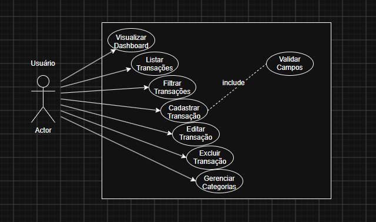
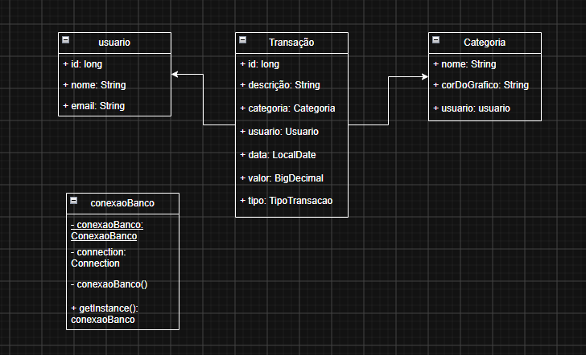

# 💸 FinanceFlow - Sistema de Gestão Financeira Pessoal

> Sistema desktop focado em usabilidade, arquitetura limpa e controle dinâmico para gerenciamento de finanças pessoais.

---

## 📄 Sobre o Projeto

O **FinanceFlow** é uma aplicação desktop desenvolvida para automatizar e simplificar o controle financeiro pessoal. Ele substitui o uso de planilhas genéricas por uma interface de usuário construída do zero, focada no minimalismo e na agilidade. O sistema permite registrar receitas e despesas, categorizar gastos e acompanhar o fluxo de caixa com validações de dados em tempo real.

### Motivo da Criação

O controle financeiro feito em planilhas ou sistemas mal otimizados costuma gerar problemas práticos:

* Interfaces poluídas que dificultam a leitura rápida do saldo.
* Falta de validação, permitindo lançamentos com dados em branco ou inconsistentes.
* Navegação travada, exigindo a abertura de múltiplas janelas para tarefas simples.

O FinanceFlow resolve isso concentrando as informações em um layout responsivo e dinâmico, utilizando painéis intercambiáveis e formulários modais (pop-ups focados) para garantir que o foco do usuário esteja sempre na informação que importa.

---

## ✨ Funcionalidades

### 📊 Módulo de Visão Geral (Dashboard)

* [x] **Navegação Dinâmica:** Menu lateral unificado onde a tela principal se limpa e redesenha sem abrir novas janelas soltas.
* [x] **Resumo de Saldos:** Cards de métricas exibindo totais de Receitas, Despesas e Saldo Líquido atualizado.
* [x] **Design Minimalista:** Uso combinado de `BorderLayout` e `GridLayout` com bordas de espaçamento (`EmptyBorder`) para uma interface limpa.

### 💳 Módulo de Transações

* [x] **Listagem Centralizada:** Tabela de histórico de transações encapsulada em um `JScrollPane`.
* [x] **Cadastro Modal Desacoplado:** Uso de `JDialog` para criar formulários sobrepostos, travando a tela de fundo para garantir o preenchimento.
* [x] **Validação Inteligente (Guard Clauses):** O sistema impede o salvamento de transações caso os campos de Descrição ou Valor estejam vazios, exibindo alertas visuais no console/tela.
* [x] **Categorização:** Classificação no ato do cadastro (Receita/Despesa e tags como Alimentação, Lazer, etc.).

---

## 📐 Documentação e Modelagem

Os diagramas de engenharia do sistema foram estruturados para guiar o desenvolvimento e refletir o uso de boas práticas de Orientação a Objetos.

### Diagrama de Casos de Uso



### Diagrama de Classes (UML)



---

## 🛠️ Tecnologias Utilizadas

O projeto foi construído seguindo rigorosamente o padrão de arquitetura **MVC (Model-View-Controller)**, separando responsabilidades visuais da lógica de negócios.

* **Linguagem:** Java (JDK 17 ou superior)
* **Interface Gráfica:** Java Swing (Componentes customizados, `JPanel`, `JDialog`, `JTable`)
* **Gerenciamento de Eventos:** ActionListeners e Expressões Lambda
* **Design Patterns:** Singleton (para gestão de instâncias únicas)

---

## 📂 Estrutura do Projeto

```text
FinanceFlow/
├── docs/
│   ├── diagrama_casos_de_uso.png
│   └── diagrama_classes.png
├── src/
│   ├── main/
│   │   ├── java/
│   │   │   └── org/
│   │   │       └── example/
│   │   │           ├── controller/
│   │   │           ├── model/
│   │   │           └── view/
│   │   │               ├── PainelVisaoGeral.java
│   │   │               ├── PainelTransacoes.java
│   │   │               └── FormularioTransacaoDialog.java
│   │   └── resources/
│   │       └── images/
├── pom.xml (ou build.gradle)
└── README.md
```

## 🚀 Como Rodar o Projeto

### Pré-requisitos
* Java JDK 17 ou superior instalado na máquina.
* Uma IDE de sua preferência (IntelliJ IDEA, Eclipse ou VSCode).
* Git para versionamento.

### Passo a Passo

1. **Clone o repositório:**
   ```bash
   git clone [https://github.com/SEU_USUARIO/FinanceFlow.git](https://github.com/SEU_USUARIO/FinanceFlow.git) ``` 

2. **Importe o projeto na sua IDE:**
   * Abra a IDE e selecione a opção de abrir/importar projeto.
   * Navegue até a pasta clonada e selecione-a.

3. **Execute a Aplicação:**
   * Localize a classe principal (geralmente `Main.java` na raiz do pacote `org.example`).
   * Clique com o botão direito e selecione `Run 'Main.main()'`.

---

## 🛤️ Próximos Passos (Roadmap)

* [ ] **Persistência de Dados:** Substituir os dados estáticos (mockados) por um banco de dados real (SQLite ou MySQL) ou salvar em arquivos locais.
* [ ] **Filtros e Buscas:** Implementar barra de pesquisa para filtrar transações por data ou categoria.
* [ ] **Edição e Exclusão:** Habilitar os botões de ação nas linhas da tabela de transações.
* [ ] **Gráficos Visuais:** Integrar uma biblioteca (como JFreeChart) para desenhar o fluxo de caixa.

---

## 👤 Autor

* **Nicolas Guedes da Silva** - *Arquiteto de Software & Desenvolvedor Full Stack*

---

## 📜 Licença

Este projeto está sob a licença MIT. Veja o arquivo `LICENSE` para mais detalhes.